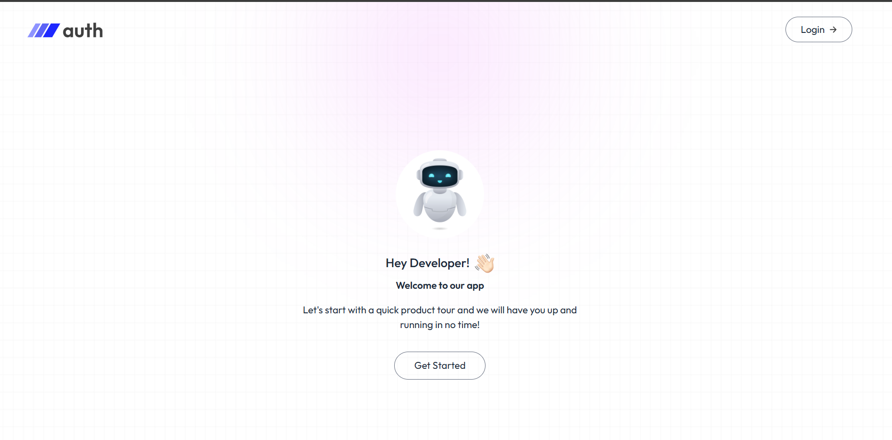

# 🔐 MERN Authentication System

A production-ready authentication system built using the **MERN stack** (MongoDB, Express, React, Node.js).  
This project implements **JWT authentication**, **email verification**, and **password reset** using secure and industry-standard practices.

---


## Screenshots




## ✨ Features

- User Registration & Login
- JWT Authentication (HTTP-only Cookies)
- Email Verification
- Forgot Password & Reset Password
- Protected Routes
- Password Hashing with bcrypt
- Token Expiration Handling
- Responsive UI

---

## 🧰 Tech Stack

### Frontend
- React (Vite)
- React Router DOM
- Axios
- React Toastify

### Backend
- Node.js
- Express.js
- MongoDB & Mongoose
- JSON Web Tokens (JWT)
- Nodemailer
- bcryptjs
- dotenv
- cookie-parser

---


## 🚀 Installation & Setup

### Backend Setup

```bash
cd Auth-backend
```
```
npm install
```
```
npm run dev
```


### Frontend Setup

```bash
cd Auth-frontend
```
```
npm install
```
```
npm run dev
```

Website runs on:  
`http://localhost:5173`
